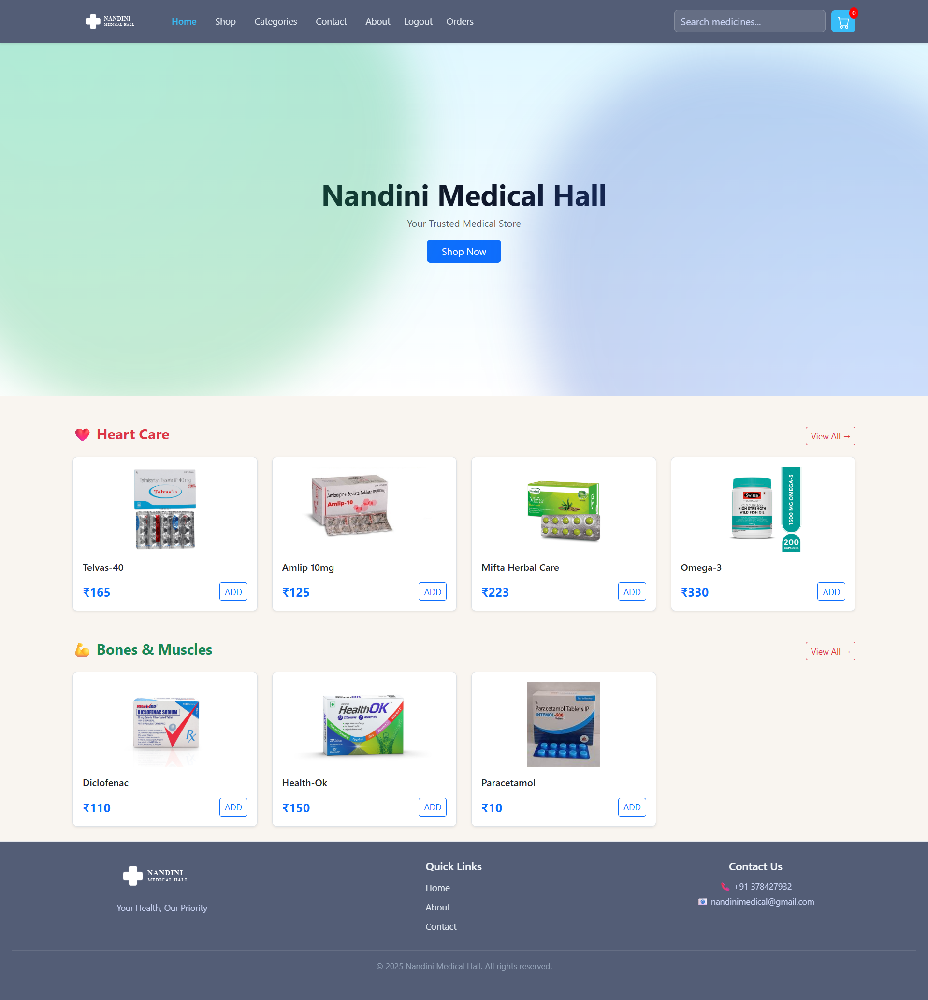
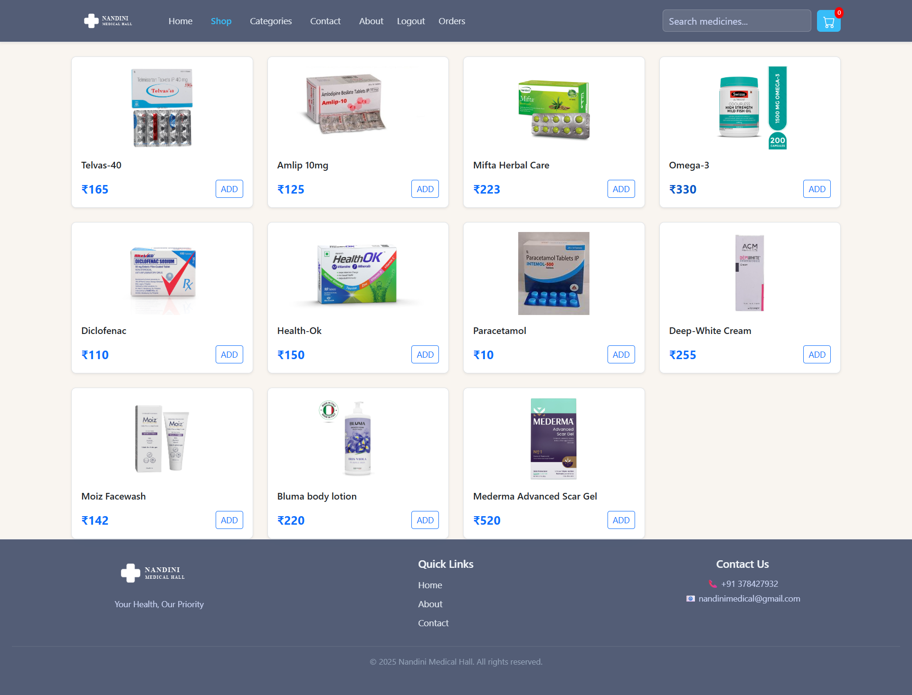
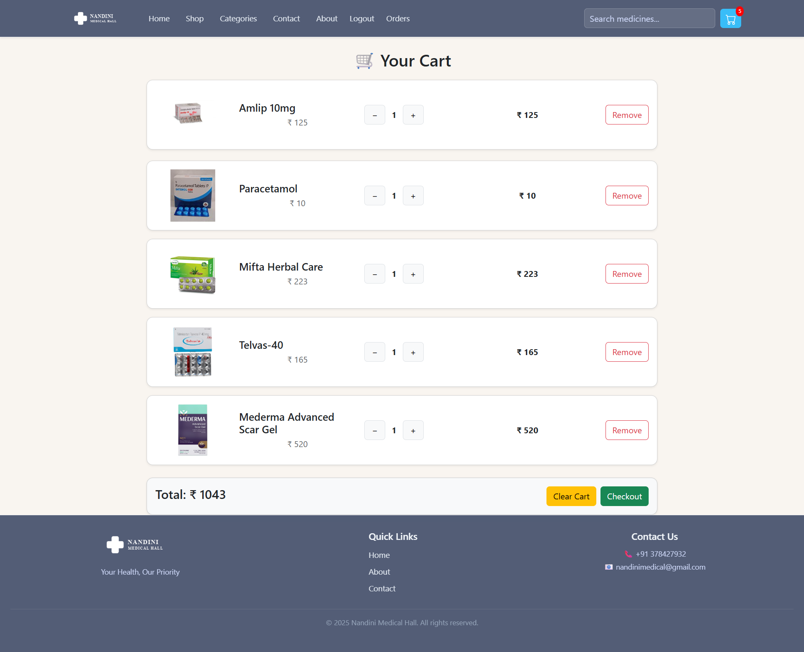
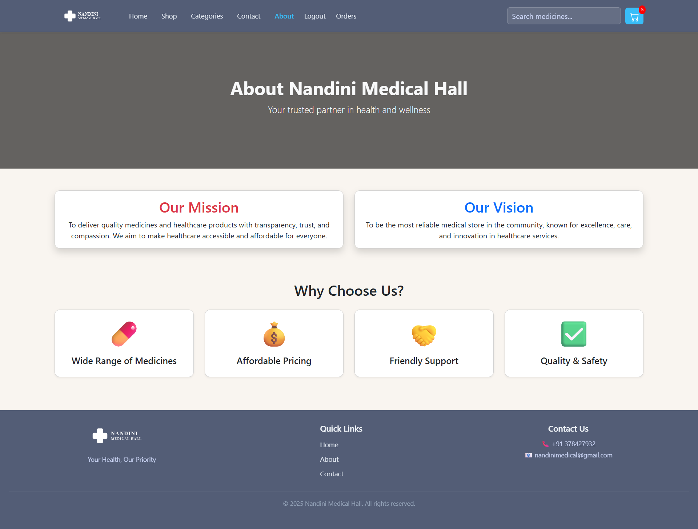
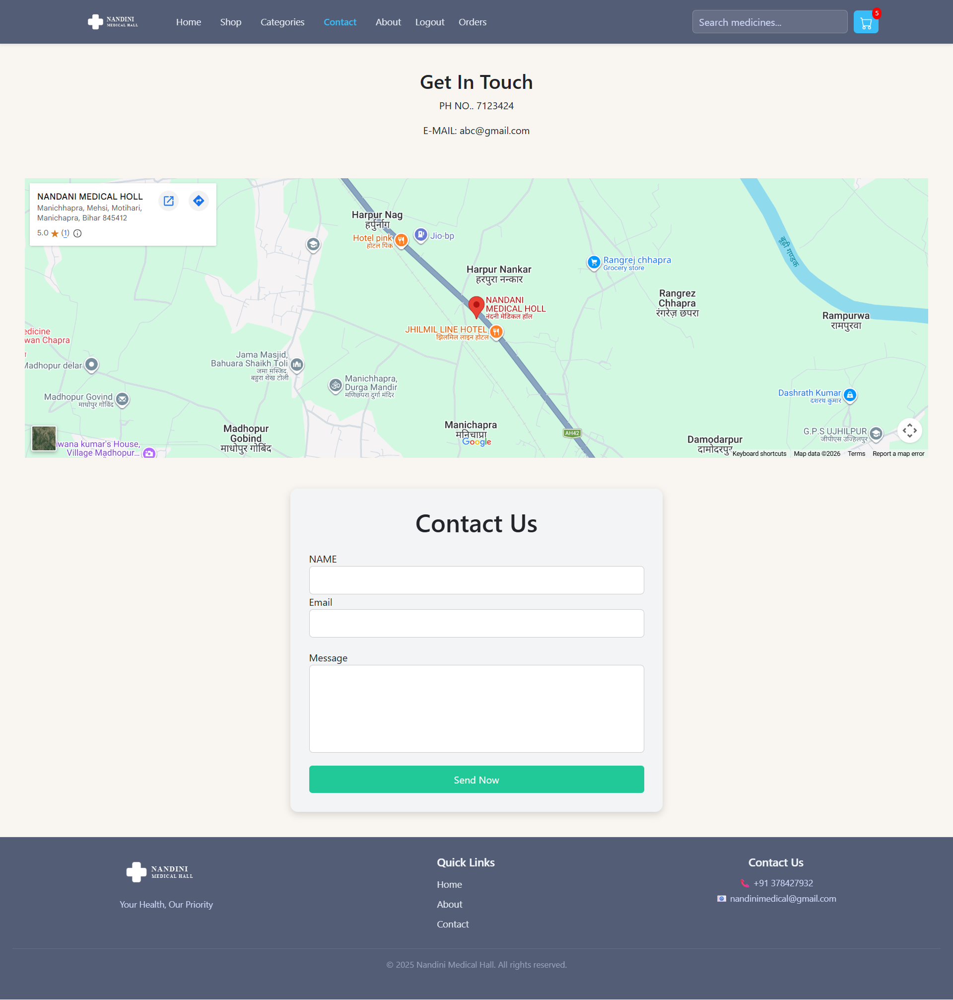
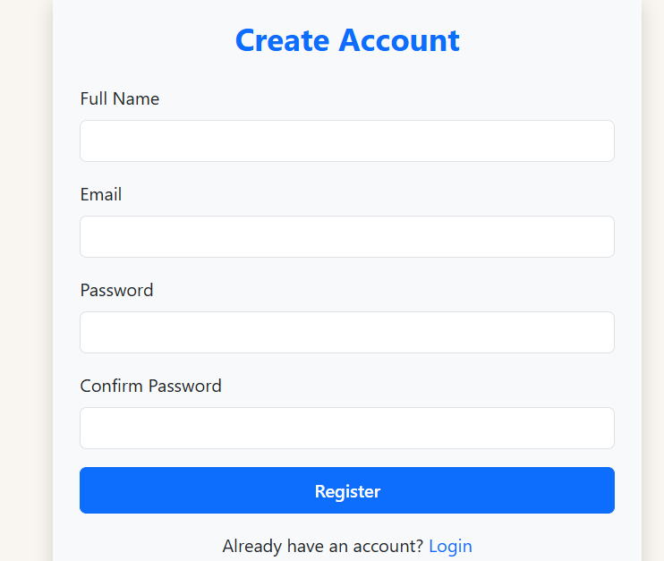
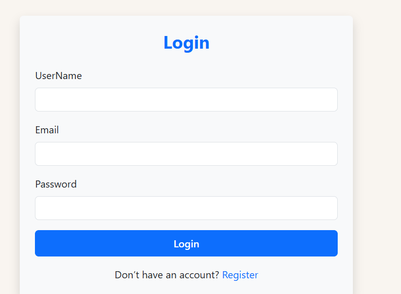

# E-Commerce Website (User Panel)

A fully functional e-commerce user interface where customers can browse products, add items to cart, and place orders seamlessly.

## 🚀 Features

- Product Listing
- Add to Cart
- Checkout Page
- Authentication (Login/Register)
- Responsive Design

## 🛠 Tech Stack

- React.js
- Redux Toolkit
- Bootstrap
- Node.js
- Express.js
- MongoDB

## 🌐 Live Demo

Coming soon...

## 📦 Installation

```bash
npm install
npm run dev
```

## 📸 Screenshots

### Home Page



### Shop Page



### Cart Page



### About Page



### Contact Page



### Register Page



### Login Page


